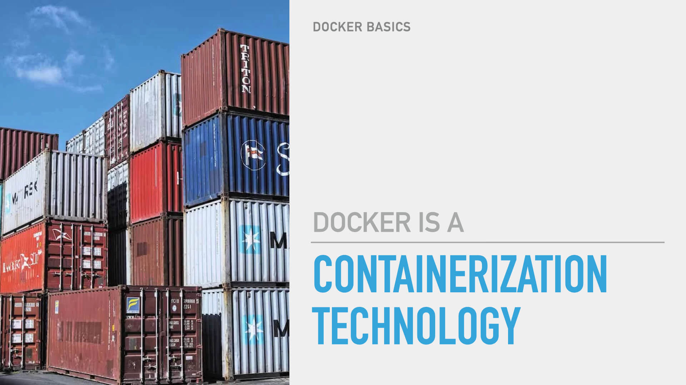
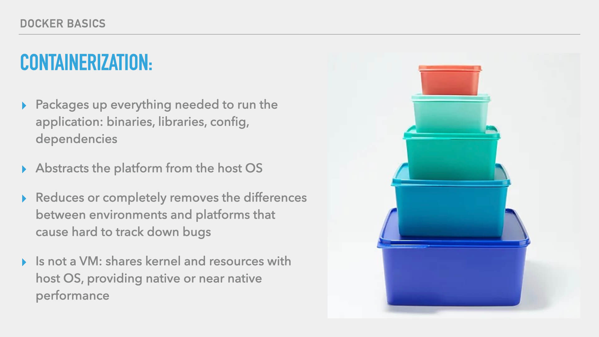
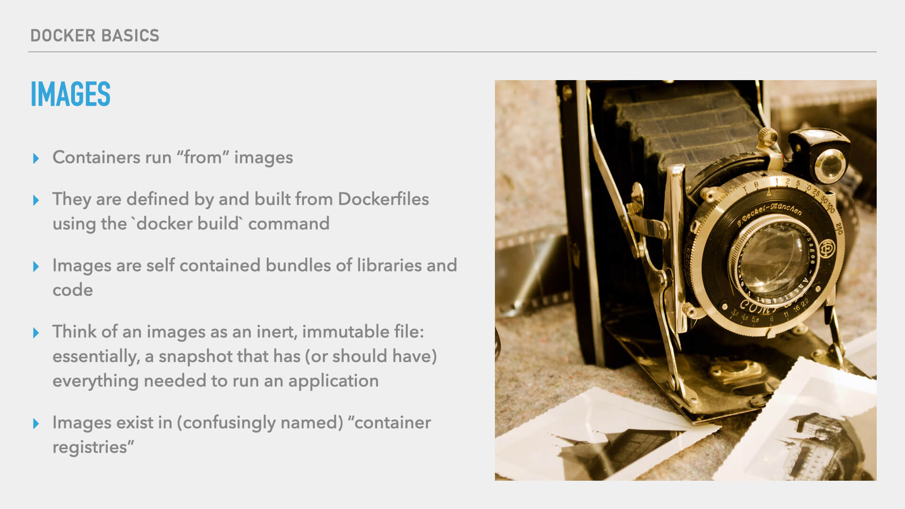
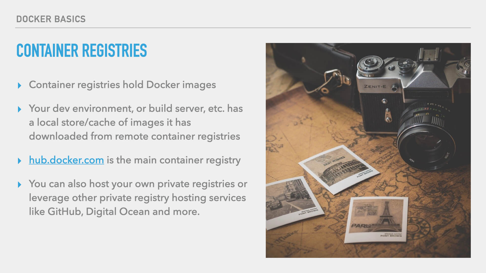
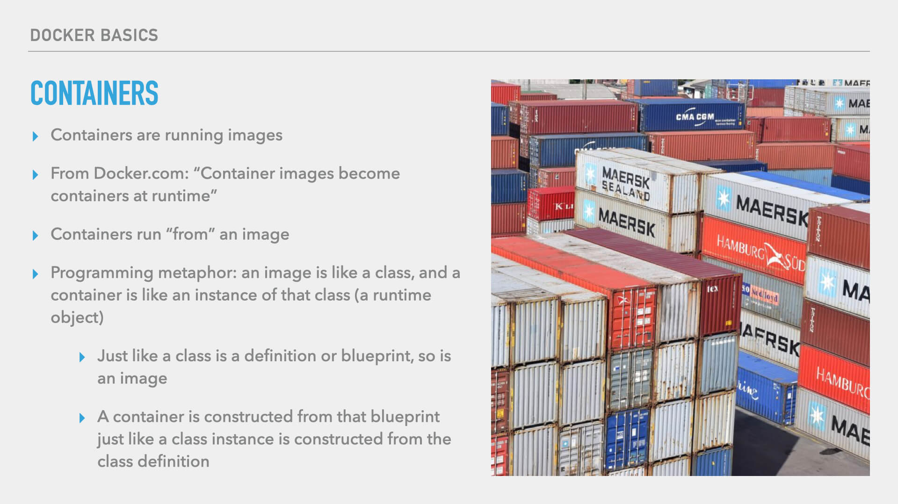
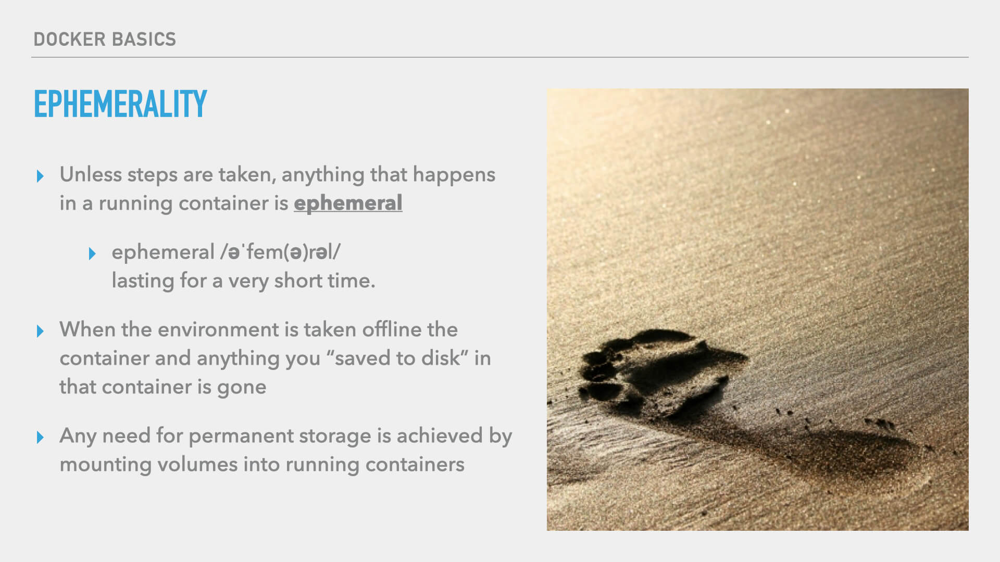
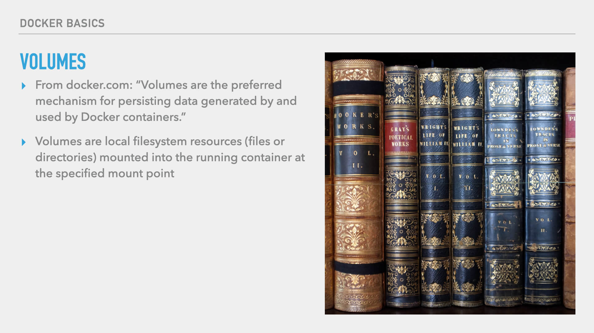
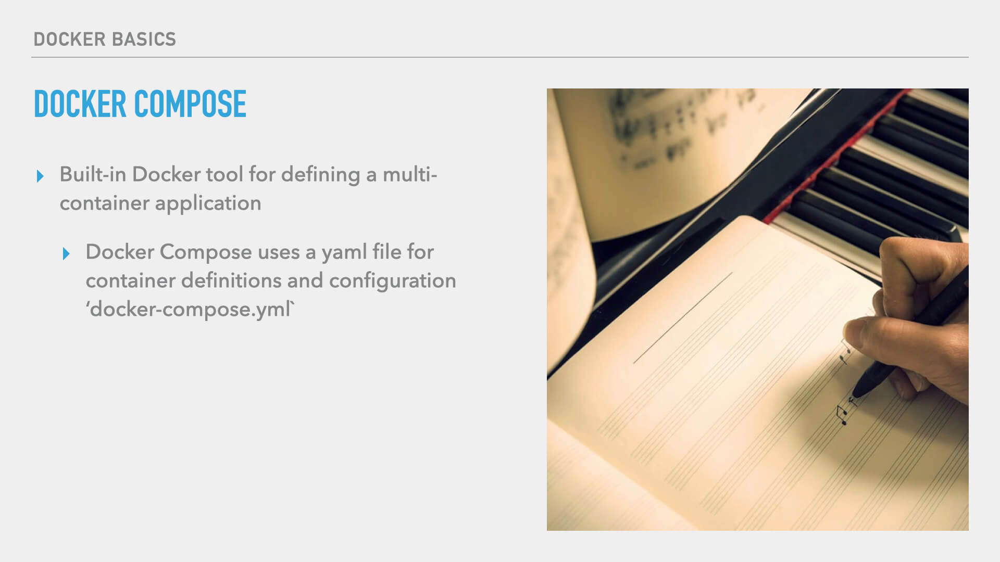

# Docker Key Concepts

When trying to understand any technology, often the best place to start is with the key concepts. And so in this lesson, we’ll give you a basic understanding of some of the fundamental concepts in the Docker landscape.

## Containerization Technology



The first thing to understand is that Docker is a containerization technology. Now, you may be saying, "Great! but what does that mean, exactly?"

Well, in the Docker context, a container is a bundle of software and all that software’s dependencies, packaged together in an environment that it can run in. The goal of this packaging it to abstract away the hosting platform and give the application the same environment to run in, every time and every place that it may run.



Containerization with Docker packages up everything needed to run an application: this includes:

- the lower level binaries on the server
- all the libraries
- configuration
- dependencies of the application

Containerization abstracts the host platform that your application is running on, and removes differences between environments that make bugs difficult to track down.

Notably, this is **not** accomplished with virtual machines. Perhaps you remember the days when many developers were using virtual machines both in local development and even in production environments. These tended to have poor performance and a host of other problems. With Docker, performance will be native, or near the native speeds you’d see if you ran all the software on the server outside of Docker.

> [!NOTE]
> While I’ll cover some of the most basic concepts to help you understand how Docker works, if you’d like a deeper dive into the technical, I recommend this article on Citrix.com titled, “[What is Containerization](https://www.netscaler.com/articles/what-is-containerization).”

## Images

Now let’s turn our attention to the concept of “Images.”



In the Docker world, images are what we call the containerized bundles of libraries and code. Docker images are used to run a container (which we’ll define in a moment). Docker images are created using the `docker build` command from the instructions developers put in Dockerfiles. The created images are self-contained bundles of libraries and code. You can liken a Docker image to an inert, immutable file. It’s essentially a snapshot that should have everything needed to run the application.

> [!TIP]
> Think of a Docker Image like a snapshot of a given time and state. The Docker Image is a frozen snapshot state of the application at the time the image was created.

## Container Registries



Images exist in “container registries,” which, unfortunately, is a name I find a tad confusing because containers are distinct from images. Nevertheless, the created images have to live somewhere, and that somewhere is container registries. Your dev environment, build server, staging server, and your production server will all have a local cache or store of images, and those locally stored images are downloaded from remote container registries. [hub.docker.com](https://hub.docker.com/) is the default, public container registry, but you can also host your own private registries or use services that provide private registries such as GitHub, Digital Ocean, and more.

## Containers



And what do you do with those images? You create containers. Containers are what we call the running images. According to [Docker’s documentation](https://www.docker.com/resources/what-container/), “Images become containers at runtime.” So, containers run “from” an image.

> [!TIP]
> I like to bring in a programming metaphor to help explain, and if you’re familiar with object-oriented programming this will make some sense to you:
> 
> Think of an image like a class, and a container like an instance of that class. So, just like a class is the definition or blueprint from which an instance is created, so is a Docker image. A container is constructed from the blueprint of the Docker image just like a class instance is constructed from a class definition.

## Ephemerality



Recall that I mentioned that images were inert and, importantly, immutable. Once an image is created it doesn’t change. To change an image, you build a new image. That’s why it’s important here to talk about the ephemeral nature of anything that happens inside a container. Unless you take steps of preservation, anything you do inside a running container is ephemeral. When an image stops running, anything you “saved to disk” is gone. This is, obviously, very important to know. So now you might be thinking, "what is the point then?"

### Volumes

Docker has provided a way to handle permanence. And that way is volumes.



Volumes are the mechanism for persisting data across container stops and starts, new containers being brought online to replace old ones, etc. A volume is just a local filesystem resource such as a file or a directory mounted into a running container at a specified mount point. If you know anything about unix mount points, Docker Volumes work in exactly the same way. You can define a file path on the host to mount into the running container, or you can tell Docker to create a volume, manage it, and mount it into the running container.

> [!NOTE]
> If you want a deeper technical dive into Volumes, I recommend this article on container-solutions.com titled, “[Understanding Volumes in Docker](https://blog.container-solutions.com/understanding-volumes-docker).”

## Docker Compose



Last, but, certainly not least in our key concept exploration, we'll explore Docker Compose.

Many of your applications may need more than one container and Docker Compose is the way you can define a multi-container environment. You will, of course, need a container to run your app, but you may also want to run containers for things like Redis, MongoDB, or MySQL. Or, a common need I’ve had is to spin up containers as services that will, essentially, run cron jobs (or, the equivalent). These may use the same image as your primary application container — which is just another beauty of Docker and the image-based ecosystem. Whatever the need, you will almost certainly need to define more than one container for many of your applications.

And even if you have only one container in your application, it’s still very useful to define the various things your container will need, volume mounts being one example.

Let’s look over a very simple and truncated Docker Compose file.

> [!NOTE]
> Docker Compose files are written in YAML. YAML is quite common as a configuration language these days, and that’s what Docker Compose uses. It’s a very readable language in which indentations define the relationship of children and parents. It’s a pretty simple language to pick up, and you can certainly find more online if you need to know the basics of the language.

In this example, I've created a simple Docker Compose YAML file (`docker-compose.yml`) that defines a couple of containers, and a managed volume.

```yaml
services:
  app:
    image: php:apache-buster
    ports:
      - "5000:80"
    volumes:
      - .:/var/www/app:delegated
  database:
    image: mariadb
    ports:
      - "5100:3306"
    environment:
      MYSQL_ROOT_PASSWORD: root
    volumes:
      - db-volume:/var/lib/mysql:delegated
  redis:
    image: redis:alpine
volumes:
  db-volume:
```

A Docker Compose file needs an array of “services.” Each key in this array defines a container. For instance, I’ve used a key named “app” to define my primary application container. For the app, I’m using a vanilla PHP image, but this could be any image that suites your app’s needs.

For the purposes of development and this demo, I’m doing some port mapping (`"5100:3306"`). With the port mapping, I’m telling Docker that when I access my machine’s local host on port 5000, it should map that to port 80 in the container. This is something you would only do for your local dev, and not something you would do in production. In fact, if you’re using Docker Swarm in production, which is what I recommend if you’re running you’re own Docker server, this setting won’t even have any effect. There are also a variety of ways around port mapping in local dev which are beyond the scope of our key concepts here.

You can also see in the examples that I've defined some volumes for our app container. In this case, again, for local dev (not something you'd do in production), I’ve mounted the entire codebase on my computer's filesystem to `/var/www/app` in the container. I’ve also used the `:delegated` flag, which will give your local dev environment a slight I/O speed increase. You can read more in Docker’s documentation. This, again, is for local development. In production, you would typically build all of your application’s files into the image. But you don’t want to run a build every time you make a change to files when you're actively developing.

In the example I've also defined a database container. You can certainly run this in production, particularly on smaller apps. But in larger application environments, you may not be running a database container in your Docker stack, you may only need this for local dev and connect to a managed database in production. So that’s something to keep in mind. In any event, in the example I’m using a container to run MariaDB. And I’ve set up a volume for Docker to manage that MariaDB data will be stored in. In the volumes definition array, I’ve given the volume a name. This means Docker will create and manage a volume for me and I don’t have to worry about it or where it’s at. And then up in the container definition, I’ve mounted the volume at the point where MariaDB expects to find its data. Since MariaDB is a drop-in MySQL replacement, that path is `/var/lib/mysql`

---

And those are the key concepts to keep in mind as we move forward in understanding how to leverage Docker. In future lessons, we’ll start seeing all these concepts in action!
