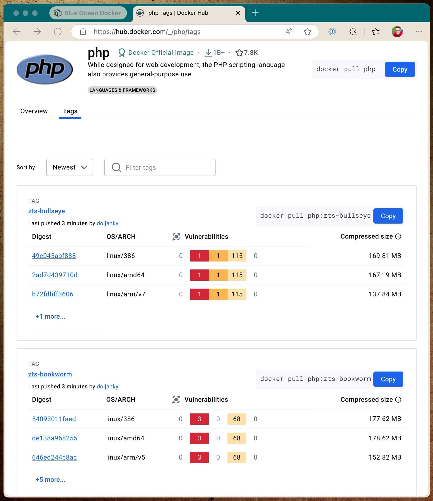
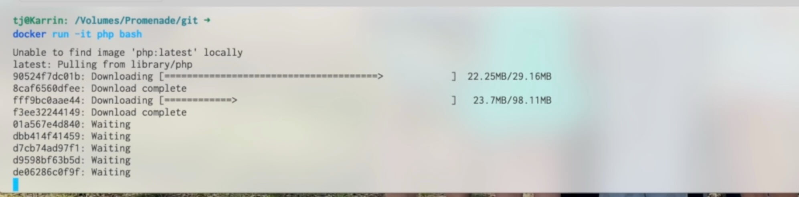
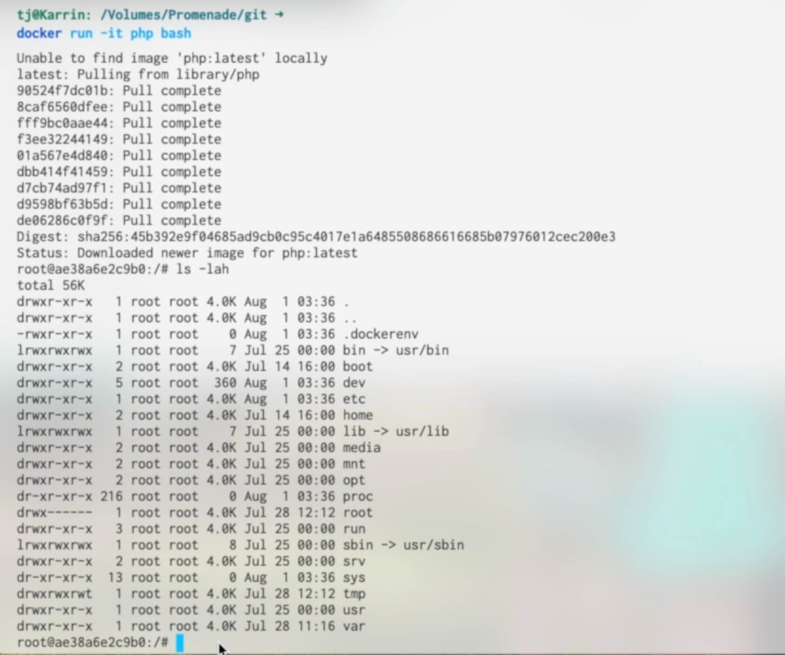
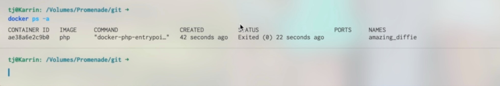
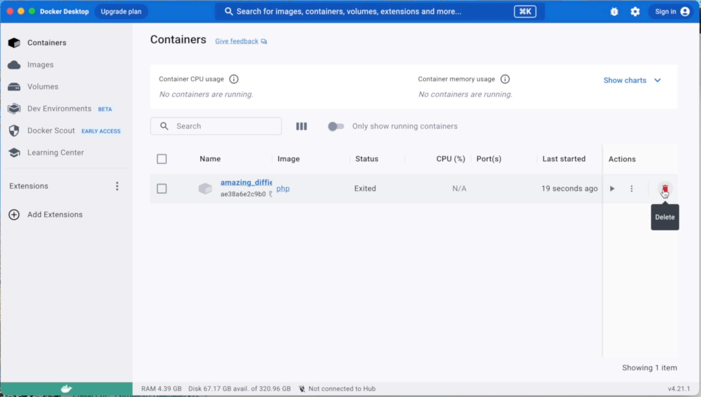
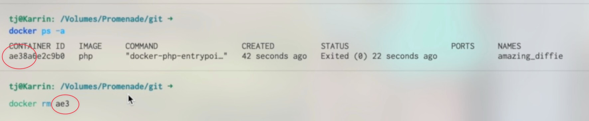
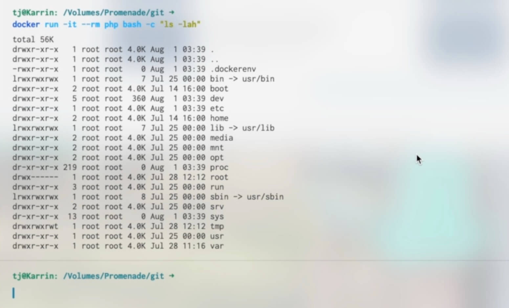
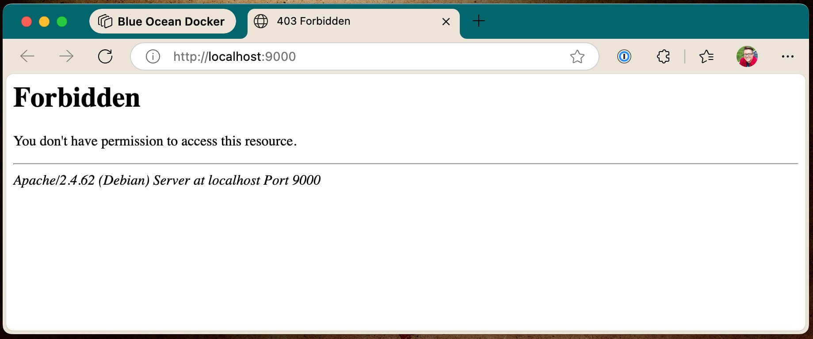
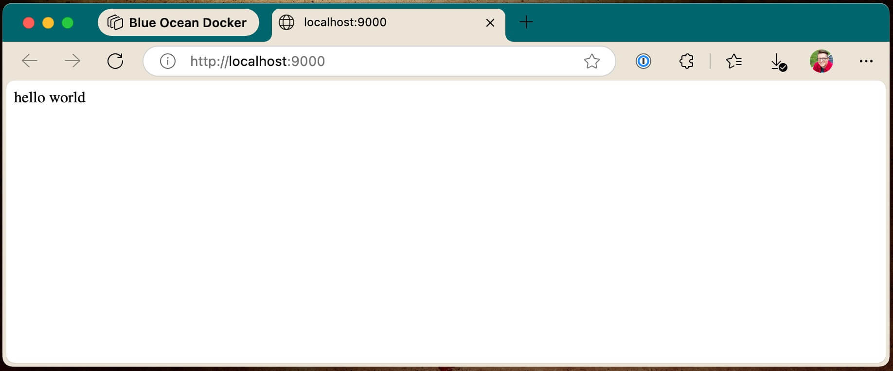
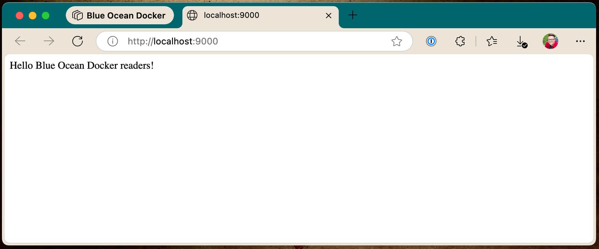

# Running a Container

Now that we’ve learned the basics, we're going to dive in to some specifics. In this lesson, we’ll learn how to run a container. What we’ll be doing is executing commands in containers running on your computer. The containers will start up and run, and then shut down.

In future lessons we’ll talk about starting and running an entire environment of containers, keeping them online, running in production, etc. But for now, we’re just going to focus on running commands.

The first thing to note is that [hub.docker.com](https://hub.docker.com/) is where you go to find public images. For instance, if you want a PHP image, you can go [here to the official PHP image](https://hub.docker.com/_/php).

And you can note on the [tags tab](https://hub.docker.com/_/php/tags) that there are many different tags for the PHP image.



With Docker images, tags are different versions of an image. Tags are deleniated by a colon. For instance, `php:8.4.7` where `8.4.7` is a tag that is available.

> [!NOTE]
> For pretty much every image, you'll see a tag called "latest". That is a convention in the Docker world that the most recent image is always tagged "latest." So for instance, if you did `docker pull php:latest`, you would get the most recent version of the vanilla PHP image.

With most images, tags are used as a type of version control method. For instance, if you have an older application that can't yet run PHP 8, you can run PHP 7 by specifying one of the `7` tags.

## The `docker run` command

So let's get started running an image. To do that, you'll use the `docker run` command with some arguments.

Here's the command you'll run: `docker run -it php bash`. Let's break that command down. `-i` is the flag for "interactive" and `-t` is the flag for teletype. So those two flags are telling the Docker container that you want an interactive session with the container.

The first argument after `run` — in this case, `php` — is telling the `run` command which image you want to run. If you do not specify a tag with a colon (something like `php:7.2`) then it will default to `:latest`.

The second argument after the `run` command is what the container should execute. In this case, we want to run `bash`. Not all images may have `bash`, but PHP does, so we'll run bash here in our interactive session.

So go ahead and run the command:

```bash
docker run -it php bash
```

Notice if you've never run or pulled the image before that it will download the image.



After the image downloads (if needed), you should be in a bash session inside a running PHP container. For instance, if you run `ls -lah` in that session, you can see all the stuff in the root of the container that you’re in.



## The `docker ps` and `docker rm` commands

Now if you `exit` the container, the container will stop running. But here's something important to take note of: we didn't specify what to do when the container stopped running. So the container, or the ghost of the container, is actually still sitting around, stopped, not running, but there.

You can confirm this by running `docker ps -a`. `ps` lists containers, and the `-a` flag tells the command to list all containers, including the stopped containers.

> [!NOTE]
> By default, `docker ps` will only list running containers. Use the `-a` flag to list even stopped containers that still exist.

Go ahead and run this command now:

```bash
docker ps -a
```



It should list the container you just ran with a status of `Exited`, which means it's no longer running.

If you're using [Docker Desktop](https://docs.docker.com/desktop/) (or [OrbStack](https://orbstack.dev/)), you can also see in the GUI interface the status of containers, including containers that have exited and are no longer running, and you can delete them from there.



You can also use the `docker rm` command, sending it the ID of the container to `rm` as the first argument. The argument doesn't have to be the full ID, but requires enough of the ID to be unique. Usually just the first three characters of the ID are enough.



## The `--rm` flag

What we really want to do most of the time is have a container auto-remove itself once we're done with it. To do that, you can use the `--rm` flag with `docker run`, and that will instruct Docker to remove the container when it exits.

So go ahead and run that command now:

```bash
docker run -it --rm php bash
```

Once you're in the container, go ahead and type `exit` and press return to exit the container. And now if you run `docker ps -a` you'll see that the container is not listed.

## Running a command then exiting with `-c`

Something that may be a little more useful most of the time than dropping into a command line session in a container is running a command then exiting.

For the purposes of illustration, I'll show running the `ls` command to list files and directories inside the Docker container — which is probably not all that useful in your day-to-day Docker activities, but it should give you an idea of how to run commands.

We'll continue building on the same command we used before: `docker run -it --rm php bash`, but now we'll add the `-c` option with a command to run. To run `ls` that would be like this:

```bash
docker run -it --rm php bash -c "ls -lah"
```

That will print out the list of files and directories in the working directory of the image and then exit.



And because we used the `--rm` flag, the exited container will also be removed once it has finished running the command.

## Running the `php:apache` image

Now let's do something a little more useful. We will now get the `php:apache` image running and serving a website. The PHP images all have Apache tag variants with a basic Apache setup ready to go and serve a website.

In order to serve a website from `docker run` with that image, we'll need to specify a port mapping — which we talked about briefly in the [Docker Key Concepts lesson](/lesson/key-concepts).

The basic concept is this: map an unused port on your localhost, to the port the Docker container is serving content over. For websites that will be port 80.

> [!NOTE]
> You can also, of course, configure Apache to serve SSL and HTTPS with SSL certificates over port 443, which is beyond the scope of our lesson here, but do know that it's certainly possible to do that.

To do the port mapping with the `docker run` command, we'll need to use the `-p` option. For the purposes of this demo command, I'll use `9000` for the port on the host. That is probably unused on your localhost as well. If it is in use, you can choose any other unused port. Here's the command:

```bash
docker run -it --rm -p 9000:80 php:apache
```

The port on the left side of the colon is the port to use on your localhost, and the port on the right side of the colon is the one to map to inside the container. So with that command above, if you hit [http://localhost:9000](http://localhost:9000) on your localhost, it will hit port 80 inside the container.

Go ahead and run that command now. Once it's running (if you've never used that image before, Docker will need to download it first), Apache is now ready to receive connections. Go ahead and load [http://localhost:9000](http://localhost:9000) in your browser.

Now, of course, there's nothing for Apache to serve in this container, so you'll get an error message from Apache.



But in this case an error message is actually good if it's coming from the container and Apache. It means the Apache container is online and serving things through the port map.

And now at this point if you send the interrupt signal (ctrl + c) to your terminal running the `php:apache` container, it should shut down and the exited container should be removed.

## Mounting a directory with an index.php file for `php:apache` to serve

Now we're going to get Apache and PHP to serve up some very simple PHP through that Docker container. In order to do that, create a directory called `php-example`. Then place an `index.php` file in that directory with the following contents:

```php
<?php

echo 'hello world';
```

The command we'll run to serve this index file is as follows:

```bash
docker run -it --rm -p 9000:80 -v $(pwd):/var/www/html php:apache
```

Let's break down the new part of this command here. We're using the `-v` option (`v` stands for "volume") to mount a local file system resource on the local computer into the running Docker container. `pwd` stands for "print working directory" so it prints out the current location of your bash session into that command on the left side of the colon. The left side of the colon is the "source" path of the local filesystem resource.

On the right side of the colon is the path to mount the filesystem resource into in the running container. In this case, we're putting it where the default Apache configuration in the container expects to serve from.

So armed with that knowledge, from a bash session `cd`ed into the `php-example` directory, run the command above. Once that's running, load up [http://localhost:9000](http://localhost:9000) in your browser again. You should see your successful "hello world" page.



For bonus points, you can edit the "hello world" response to be something else, refresh the page, it should be reflected there.



## Other applications

The usefulness of Docker becomes more apparent and more powerful when you realize you can use it to run and manage versions of software and applications that are different across projects and services. For example, let's say that we have an older project that is running Node 12 (yes, yes, I know, very outdated — that could _never_ happen in the real world to a real project…). With Docker, it becomes trivial to use a Docker image of Node 12 for that project, and not have to manage various versions of various projects and software stacks.

To install `yarn` dependencies in that node project, you could do something like this:

```bash
docker run -it --rm -v $(pwd):/app -w /app node:12 bash -c "yarn"
```

That makes things super simple, and version control of engines and languages easy. And that's just a small taste of the power of Docker.

In future lessons, we'll explore how to create projects and multi-container environments that keep themselves running with [Docker Compose](https://docs.docker.com/compose/), and how to take that all out to production.
